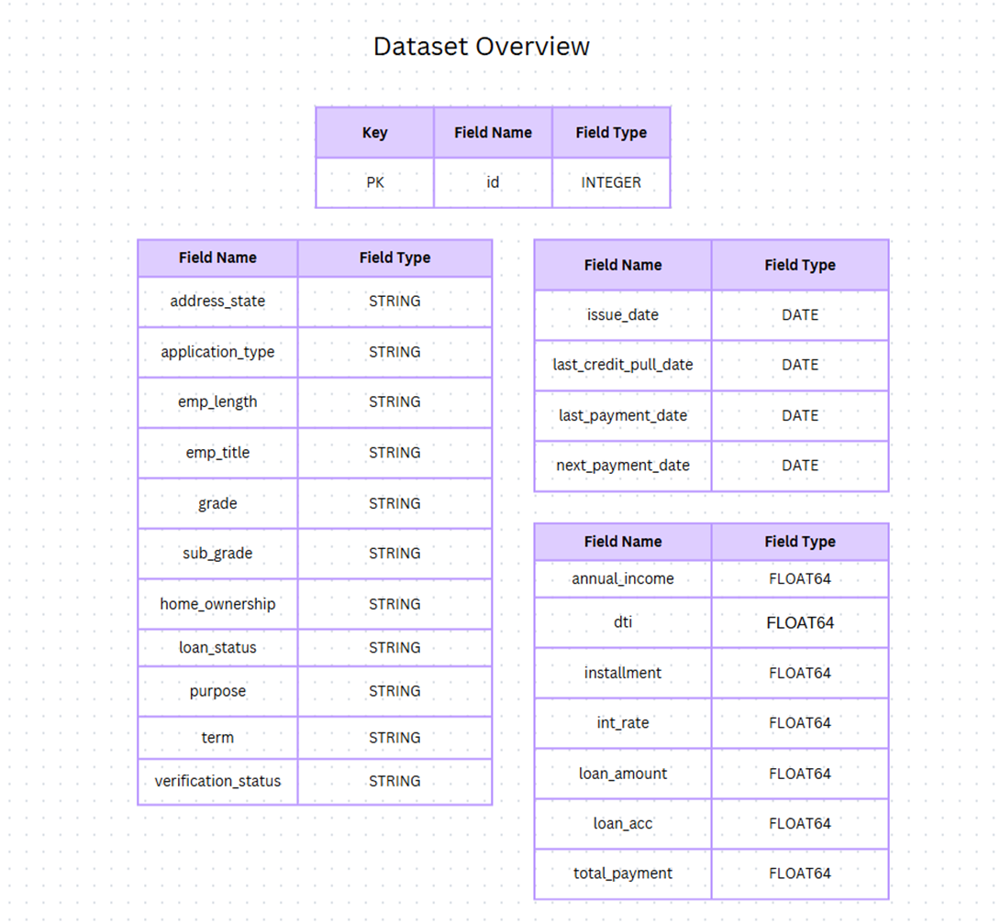

# Project 3 - Bank Loan Analysis Report (Tableau Public)

## Project Background and Overview of the Project
### Project Background: 
In today's dynamic financial landscape, effective management of lending activities is crucial for the success and sustainability of any financial institution. 
Banks need comprehensive tools to monitor and assess the performance of their loan portfolios, identify trends, and make data-driven decisions.
The Bank Loan Analysis Dashboard project was initiated to address these needs, providing an interactive and insightful visual representation of critical loan-related metrics.
The project focuses on creating a multi-faceted dashboard that empowers decision-makers by offering an in-depth understanding of lending trends, loan portfolio health, and borrower profiles. 
This dashboard combines essential Key Performance Indicators (KPIs) with advanced visualizations to enable strategic planning and improve operational efficiency.

### Overview of the project:
The primary goals of this project are:
1.	Performance Monitoring: Track key metrics such as total loan applications, funded amounts, repayments, and average interest rates over time.
2.	Loan Quality Assessment: Distinguish between 'Good Loans' and 'Bad Loans' using KPIs to evaluate the quality of the loan portfolio.
3.	Regional and Demographic Insights: Analyze loan performance across regions, loan terms, employment categories, and home ownership statuses.
4.	Trend Analysis: Leverage historical data to identify monthly trends, regional patterns, and key factors influencing loan performance.
5.	Comprehensive Detailing: Provide a consolidated overview of all loan data, including borrower profiles, for quick and efficient decision-making.

This project serves as a strategic tool, enabling stakeholders to maintain a healthy loan portfolio, optimize lending strategies, and identify growth opportunities while minimizing risks. By aligning data insights with business goals, the dashboard aims to be a cornerstone of informed decision-making in lending operations.

- ** Tableau Public Dashboard ** : [View Dashboard] (https://public.tableau.com/app/profile/sameera.tanveer/viz/Project-3-Bank-Loan-Analysis-Report/Summary)

## Data Structure: 

The dataset used in the project contains 24 features and 38,576 rows, representing detailed information about loans, borrowers, and their repayment history. 
These features are grouped into the following categories:
1.	##### Loan Information:
   
•	Loan ID: Unique identifier for each loan.

•	Loan Amount: The principal amount of the loan.

•	Interest Rate (Int Rate): The rate charged on the loan.

•	Installment: Monthly payment amount

•	Term: Loan duration (e.g., 36 months, 60 months).

•	Grade and Sub Grade: Risk ratings assigned to the loan.

•	Loan Status: Current status of the loan (e.g., Fully Paid, Current, Charged Off).

2.	##### Borrower Information:
   
•	Member ID: Unique identifier for each borrower.

•	Emp Title: Borrower’s job title.

•	Emp Length: Borrower’s years of employment.

•	Annual Income: Borrower’s yearly income.

•	Home Ownership: Borrower’s housing status (e.g., Own, Rent, Mortgage).

•	Address State: State of residence.

3.	##### Application Details:
   
•	Application Type: Type of application (e.g., Individual, Joint).

•	Purpose: Reason for the loan (e.g., debt consolidation, home improvement).

•	Verification Status: Verification of borrower-provided information.

4.	##### Repayment Data:
   
•	Last Payment Date: Date of the last payment made.

•	Next Payment Date: Scheduled date for the next payment.

•	Total Payment: Total amount repaid so far.

•	Last Credit Pull Date: Last date credit information was updated.

5.	##### Credit Profile Metrics:
   
•	DTI (Debt-to-Income): Ratio of borrower’s debt payments to their income.

•	Total Accounts (Total Acc): Total number of credit accounts.

This dataset offers a comprehensive view of loan applications and their performance, covering borrower profiles, loan details, and repayment histories. It forms the backbone of our Bank Loan Analysis project by enabling deep insights into lending trends and borrower behaviors.

## Executive Summary: 

The Bank Loan Analysis provides valuable insights into lending patterns, profitability, and borrower behavior. 
Here are the key findings: 

1. ##### Month-over-Month Trends:
   
    a.	Loan applications increased by 6.88%, funded amounts by 12.9%, and total amounts received by 15.7%.
   
    b.	The average interest rate rose by 3.5%, while the average Debt-to-Income (DTI) ratio increased by 13.6%.

2. ##### Good vs. Bad Loans:
   
    a.	86.2% of loans are classified as good loans, highlighting strong portfolio quality. However, 13.8% bad loans indicate a need for stricter screening.
   
    b.	Good loans generated $432.9M in repayments from $367.8M funded, showcasing strong profitability.
   
    c.	Bad loans, in contrast, resulted in a $28.1M loss, with $65.1M funded but only $37M received.

3. ##### Borrower Characteristics:
   
    a.	Borrowers with lower DTI ratios and interest rates are highly likely to have good loans, emphasizing the importance of evaluating these metrics during loan approval

1. ##### Regional Insights:
   
    a.	California leads in loan applications and profitability, while Maine has the lowest activity. 
        States with more applications also tend to be more profitable.

2. ##### Loan Term Analysis:
   
    a.	Loans with 60-month terms outperform those with 36-month terms in terms of profitability and performance.

3. ##### Purpose Analysis:
   
    a.	Debt Consolidation: The most common and profitable purpose, generating $1.1M more in repayments than funded.
   
    b.	Small Business Loans: A loss-making category, with $1.2M funded but only $1.1M received.

These findings suggest focusing on debt consolidation loans, expanding lending in profitable states, and prioritizing borrowers with lower DTI and interest rates. Additionally, efforts to reduce bad loans and re-evaluate small business loans could further improve profitability.

## Recommendations: 
1.	Focus on Debt Consolidation Loans:
        Since debt consolidation loans are the most profitable, the bank should consider increasing its focus on this category. This could involve offering more competitive interest rates and tailored products to attract borrowers seeking debt consolidation, which will further improve profitability.
3.	Improve Screening for Small Business Loans:
        Small business loans have shown a loss, with the bank funding more than it received. To address this, the bank should refine its loan approval process for small businesses, ensuring better risk assessments, possibly by adding stricter financial health criteria for applicants.
4.	Leverage Lower DTI and Interest Rates:
        Since borrowers with lower DTI ratios and interest rates are more likely to repay their loans successfully, the bank should prioritize lending to borrowers with these characteristics. Implementing a stronger focus on DTI and interest rates during loan origination could reduce the risk of bad loans and enhance repayment rates.
5.	Expand Lending in High-Performing States:
        Given that states with more loan applications are also the most profitable, the bank should explore opportunities to increase its marketing and outreach efforts in these states. Additionally, expanding loan products and improving customer service in these regions may further boost lending performance.
6.	Re-evaluate Loan Terms:
        Loans with shorter terms (36 months) have shown better performance compared to 60-month loans. The bank should consider promoting shorter-term loans, especially for higher-value loan applications, while evaluating the impact of different term lengths on overall portfolio health.
7.	Focus on Good Loan Applications:
        With 86.2% of loans classified as good loans, the bank should continue strengthening its focus on this segment. This could involve offering incentives for borrowers with good credit scores or low-risk profiles, as they contribute significantly to the bank’s profitability.
8.	Monitor Loan Status Regularly:
        With a notable 13.8% of bad loans, it is essential to continuously monitor loan performance and take timely actions to minimize defaults. Regular reviews of loan status, including the implementation of early warning systems, could help in identifying bad loans and addressing them proactively.

